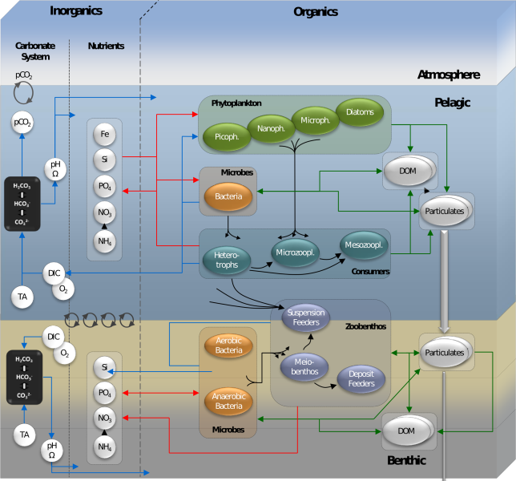

# About ERSEM

[ERSEM](http://ersem.com) is a marine ecosystem model. It describes the
biogeochemical cycling of carbon, nitrogen, phosphorus, silicon, oxygen and
iron through pelagic and benthic ecosystems. The ecosystem is divided into
functional types, which are further subdivided by traits such as size. In the
pelagic, ERSEM by default distinguishes:

* 4 types of phytoplankton: diatoms, picophytoplankton, nanophytoplankton,
  microphytoplankton
* 3 types of zooplankton: nanoflagellates, microzooplankton, mesozooplankon
* bacteria

The benthic system includes:

* 3 types of infauna: meiofauna, suspension feeders, deposit feeders
* 2 types of bacteria: aerobic and anaerobic

In addition, ERSEM tracks the concentrations of phosphate, nitrate, ammonium,
silicate, iron, oxygen, dissolved inorganic carbon and alkalinity in the
pelagic and in sediment porewaters. It includes several classes of particulate
and dissolved organic matter in pelagic and sediment. A carbonate system module
calculates pH and calcium carbonate saturation.

Through [FABM](http://fabm.net), ERSEM can be coupled to a wide range of
hydrodynamic models including NEMO, FVCOM, ROMS and GOTM. FABM also makes it
easy to customise the default set of functional types described above, and to
combine ERSEM with modules representing other parts of the ecosystem, including
fish communities, shellfish, seagrass meadows and spectraly resolved irradiance.

# How to cite

If you would like to refer to ERSEM in publications, please cite:

Butenschön, M., Clark, J., Aldridge, J.N., Allen, J.I., Artioli, Y.,
Blackford, J., Bruggeman, J., Cazenave, P., Ciavatta, S., Kay, S., Lessin, G.,
van Leeuwen, S., van der Molen, J., de Mora, L., Polimene, L., Sailley, S.,
Stephens, N., Torres, R. (2016). ERSEM 15.06: a generic model for marine
biogeochemistry and the ecosystem dynamics of the lower trophic levels.
Geoscientific Model Development, 9(4), 1293–1339.
doi: [10.5194/gmd-9-1293-2016](https://doi.org/10.5194/gmd-9-1293-2016).

If you would like to refer to the ERSEM source code, you can do so by its Zenodo DOI:

To refer to the ERSEM website, please use <http://ersem.com>.

# Support

We strongly encourage everyone using the ERSEM code to [register as a user](
https://pml.ac.uk/Modelling_at_PML/Access_Code). This gives you access to user
mailing lists where you can discuss problems and suggestions with the developers
and other users and receive information and news on the latest developments.

# License

ERSEM is free software: you can redistribute it and/or modify it under the terms
of [the GNU General Public License as published by the Free Software
Foundation](https://www.gnu.org/licenses/gpl.html), either version 3 of the
License, or (at your option) any later version. It is distributed in the hope
that it will be useful, but WITHOUT ANY WARRANTY; without even the implied
warranty of MERCHANTABILITY or FITNESS FOR A PARTICULAR PURPOSE. A copy of the
license is provided in COPYING.

Copyright 2016-2020 Plymouth Marine Laboratory.

# Acknowledgements

Over the years, ERSEM has been developed using funding from a wide variety of
sources and projects. The current codebase was developed in the NERC/Defra Shelf
Seas Biogeochemistry (Grant: [NE/K001876/1](
https://gtr.ukri.org/projects?ref=NE%2FK001876%2F1)) and Marine Ecosystems
Research Programmes (Grant: [NE/L003066/1](
https://gtr.ukri.org/projects?ref=NE%2FL003066%2F1)).
Today, ERSEM maintenance and development continues to be funded through the NERC
Climate Linked Atlantic Sector Science programme ([NE/R015953/1](
https://gtr.ukri.org/projects?ref=NE%2FR015953%2F1)) and a combination of UK
Research and Innovation (UKRI) and European Research Council (ERC) funded
research projects.
