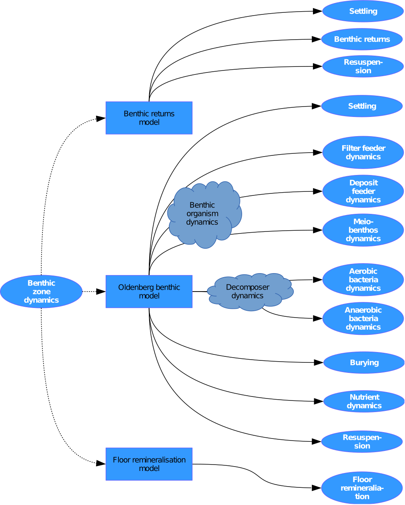

.. _benthos:

###########
The Benthos
###########

Two benthic sub-models are available: the first one is a simple benthic 
closure that linearly recycles organic material at a given time scale into 
inorgnanic material that is returned to the water column (activated by 
setting the switch `ibenXin` to 1).
The second one (activated by setting the switch `ibenXin` to 2) is
a full benthic sub-model that contains all the model infra-structure to 
compute
the biogeochemical and ecological processes in the sediments, comprising
aerobic and anaerobic layer, bioturbation and bioirrigation and the 
decomposition of organic material and recycling to dissovled carbon and 
nutrients through the sediments. It is particularly adopted to mud-flats 
and largely based on the benthic 
submodel in the first two *ERSEM* versions, described in 
:cite:`Blackford1997,Ebenhoh1995`.

