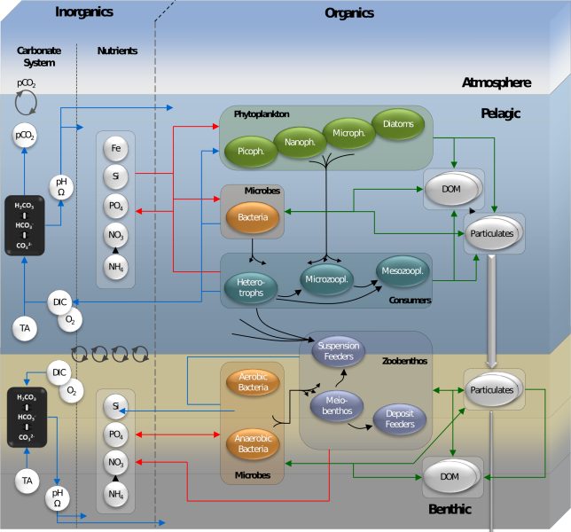

.. _concept:

##############
What is ERSEM?
##############

Background
~~~~~~~~~~

.. include:: ERSEM_model.rst

Ecosystem
~~~~~~~~~

The ecosystem in ERSEM  is divided into functional types, which are further 
subdivided by traits such as size. In the pelagic, ERSEM by default 
distinguishes:

* 4 types of phytoplankton: diatoms, picophytoplankton, nanophytoplankton,
  microphytoplankton
* 3 types of zooplankton: nanoflagellates, microzooplankton, mesozooplankon
* bacteria

The benthic system includes:

* 3 types of infauna: meiofauna, suspension feeders, deposit feeders
* 2 types of bacteria: aerobic and anaerobic

In addition, ERSEM tracks the concentrations of phosphate, nitrate, ammonium,
silicate, iron, oxygen, dissolved inorganic carbon and alkalinity in the
pelagic and in sediment porewaters. It includes several classes of particulate
and dissolved organic matter in pelagic and sediment. A carbonate system module
calculates pH and calcium carbonate saturation.

FABM also makes it easy to customise the default set of functional types described 
above, and to
combine ERSEM with modules representing other parts of the ecosystem, including
fish communities, shellfish, seagrass meadows and spectraly resolved irradiance.

   ERSEM schematic
