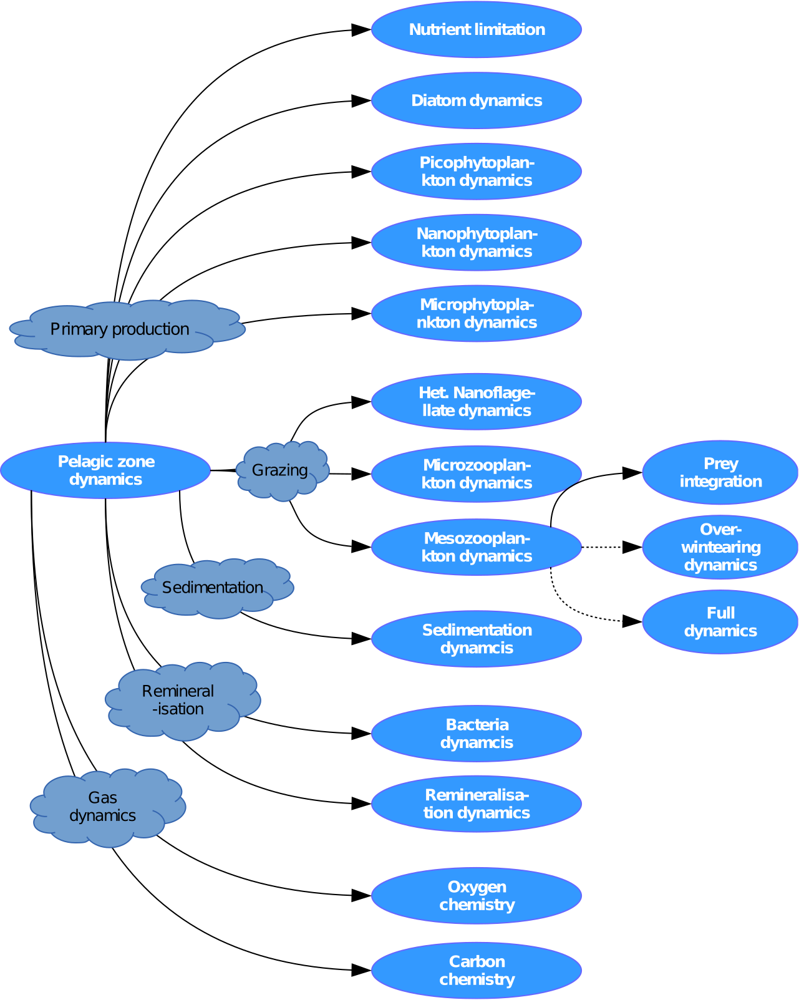

.. _pelagic:

###########
The Pelagic
###########

The pelagic sub-model contains all the model infra structure to compute
the biogeochemical and ecological processes in the water column, comprising
primary prodcution, grazing, microbial remineralisation processes,
as illustrated in figure.

