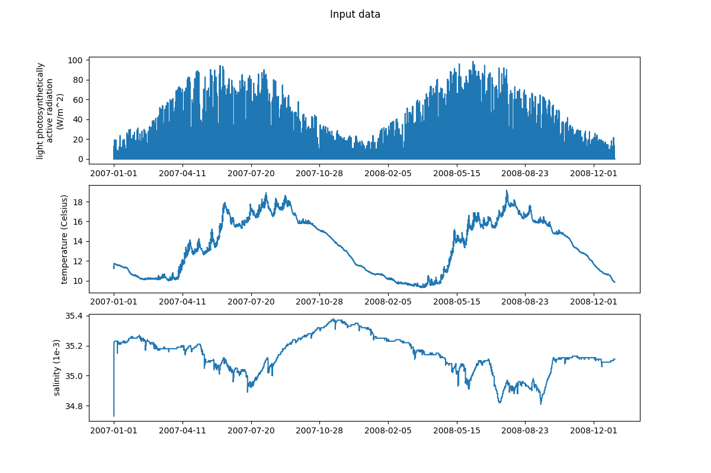
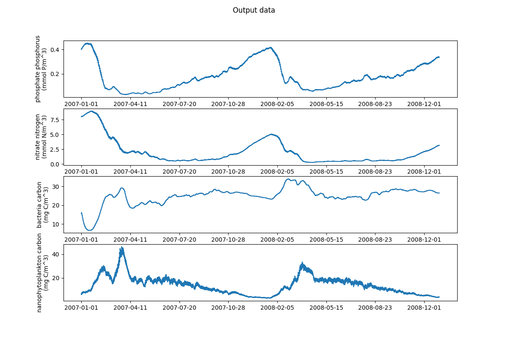

.. _fabm0d:

############################
fabm0d: ERSEM in an aquarium
############################

FABM’s 0d driver allows you to run biogeochemical models in a
"well-mixed box" under arbitrary (time-varying) environmental forcing.

Running FABM0d tutorial
~~~~~~~~~~~~~~~~~~~~~~~

To run the model, you must first obtain or generate a set of input or 
forcing files. Setups for the L4 site  are stored under version control 
and can be accessed here. 

To run the tutorial, you will first need to clone the configuration files
and then run `FABM0d`. This is done with the following:

.. literalinclude:: ../../../github-actions/fabm0d-gotm-ersem/aquarium-tut-config-setup.sh
    :language: bash
    :linenos:
.. note::
    The following script requires ``matplotlib``, ``netCDF`` and ``numpy`` to be 
    installed. This can easily be done via ``pip`` in the following way:

    .. code-block:: bash
        
        python -m pip install matplotlib numpy netCDF

To visualise the results, we again use a python script. Running the script you will need
to add a commandline argument ``--model-path`` which is the path to the output from
the FABM0d run.

.. literalinclude:: ../../../github-actions/fabm0d-gotm-ersem/aquarium-tut.py
    :language: python
    :linenos:

