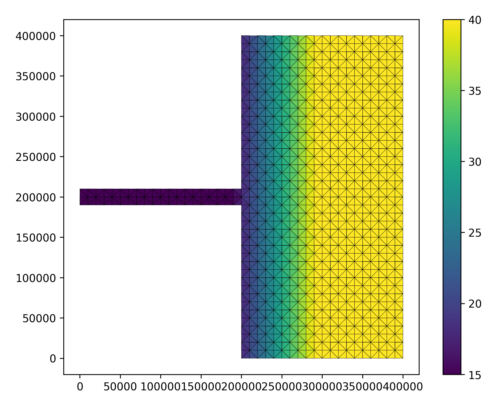

.. _fvcom:

##########################
FVCOM: ideal estuary model
##########################

This tutorial gives an end to end example how to install and then use
FVCOM-ERSEM with an ideal estuary model on a high performance computing
(HPC) machine. We have used PML's in house machine, 
`CETO <https://www.pml.ac.uk/Facilities/High_Performance_Computing>`_.
Unlike the other tutorials in this section we go through setting up
FVCOM-ERSEM on the HPC machine and then running and plotting the results.

This tutorial is based on the scripts found in the 
`ERSEM's setups repository <https://github.com/pmlmodelling/ersem-setups>`_.
The individual scripts can be found in the `ideal_estuary` folder.

.. note::
    You will need to get access to the 
    `UK-FVCOM GitLab repo <https://www.pml.ac.uk/Modelling_at_PML/Access_Code>`_.

Building and running FVCOM-ERSEM
################################

The three key packages required to run this tutorial are:

* `FVCOM <https://gitlab.ecosystem-modelling.pml.ac.uk/fvcom/uk-fvcom#fabm-ersem>`__ (UK version -- see note)
* `FABM <https://github.com/fabm-model/fabm>`__
* `ERSEM <https://github.com/pmlmodelling/ersem>`__

Both ERSEM and FABM are freely available on GitHub, however, for UK-FVCOM
you will have to register for the code -- see note above.

An example build script is as follows:

.. literalinclude:: ../ersem-setups/ideal_estuary/build.sh
    :language: bash
    :linenos:

Here you will have to adapt the script to ensure you are using the right
HPC modules and the corresponding compilers. The important compiler is the
fortran one which is set with the variable `FC`.

Another key file to change is the ``make.inc`` file, here again you will
need to change the compilers to reflect the modules you are using on the 
HPC machine. For example, on lines 74 and 75 ``IOLIBS`` and ``IOINCS`` are
set, these would need to be change to reflect the modules on the HPC machine
you are using. 

.. dropdown:: ``make.inc`` file

    .. literalinclude:: ../ersem-setups/ideal_estuary/make_ideal_estuary.inc
        :language: bash
        :linenos:

The key lines to change are:

* 74--75
* 174
* 458--465

After building FVCOM-ERSEM, we suggest you use a HPC scheduler, for example,
`SLURM <https://slurm.schedmd.com/documentation.html>`_ to run example. An
example of the SLURM script used here is given below:

.. literalinclude:: ../ersem-setups/ideal_estuary/model/estuary/launch_estuary.slurm
    :language: bash
    :linenos:

Example output from FVCOM-ERSEM
###############################

We provide two ``python`` scripts to demonstrate how to visualise both the
input files and the output files. The plotting uses ``PyFVCOM``, we suggest
you ask for access `here <https://www.pml.ac.uk/Modelling_at_PML/Access_Code>`_,
however, a version of the code is available on 
`GitHub <https://github.com/pwcazenave/PyFVCOM>`_ as well as it being 
`pip installable <https://pypi.org/project/PyFVCOM/>`__.

.. dropdown:: ``python`` input plot script

    .. literalinclude:: ../ersem-setups/ideal_estuary/plot_input.py
        :language: python
        :linenos:

Using the input ``python`` plot script, we generate the domain as follows:

.. dropdown:: ``python`` output plot script

    .. literalinclude:: ../ersem-setups/ideal_estuary/plot_output.py
        :language: python
        :linenos:

The following plots videos are produced from the plots produced by the
``python`` output plot script.

.. dropdown:: Gros primary production

	.. image:: ../../images/GPP.gif

.. dropdown:: Phosphate phosphorus

	.. image:: ../../images/N1_p.gif

.. dropdown::  Nitrate nitrogen

	.. image:: ../../images/N3_n.gif

.. dropdown:: Carbonate total dissolved inorganic carbon

	.. image:: ../../images/O3_c.gif

.. dropdown:: Diatoms chlorophyll

	.. image:: ../../images/P1_Chl.gif

.. dropdown:: Medium-sized POM carbon

	.. image:: ../../images/R6_c.gif

.. dropdown:: Salinity

	.. image:: ../../images/salinity.gif

.. dropdown:: Temperature

	.. image:: ../../images/temp.gif

.. dropdown:: Total chorophyll

	.. image:: ../../images/total_chl.gif

.. dropdown:: Tracer1 concentration

	.. image:: ../../images/tracer1_c.gif

