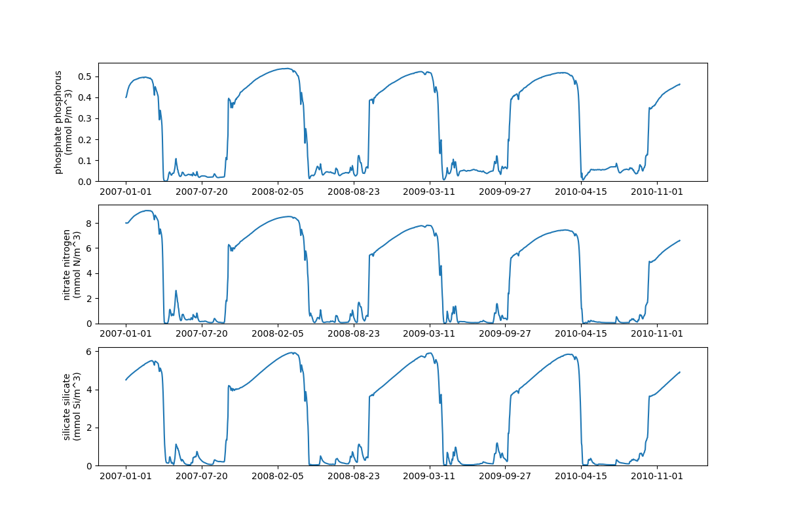

.. _gotm:

#############################
GOTM: ERSEM in a water column 
#############################

To run the model, you must first obtain or generate a set of input or 
forcing files. Setups for the L4 and BATS sites which were used in 
:cite:`ERSEM` are stored under version control and can be accessed 
here. Forcing data for the SSB sampling sites can be accessed here. 
The following example uses the L4 setup described in :cite:`ERSEM`. 

Running GOTM-FABM-ERSEM
~~~~~~~~~~~~~~~~~~~~~~~

The L4 sampling site is one part of the 
`Western Channel Observatory (WCO) <http://www.westernchannelobservatory.org.uk/>`__, 
and is located at (50°15.0'N; 4°13.0'W).

To run the tutorial, you will first need to clone the configuration files
and then run `gotm`. This is done with the following:

.. literalinclude:: ../../../github-actions/gotm-fabm-ersem/gotm-tut-config-setup.sh
    :language: bash
    :linenos:
.. note::
    The following script requires ``matplotlib``, ``netCDF4`` and ``numpy`` to be 
    installed. This can easily be done via ``pip`` in the following way:

    .. code-block:: bash
        
        python -m pip install matplotlib numpy netCDF4

To visualise the results, we again use a python script. Running the script you will need
to add a commandline argument ``--model-path`` which is the path to the output from
the GOTM-FABM-ERSEM run.

.. literalinclude:: ../../../github-actions/gotm-fabm-ersem/gotm-tut.py
    :language: python
    :linenos:

