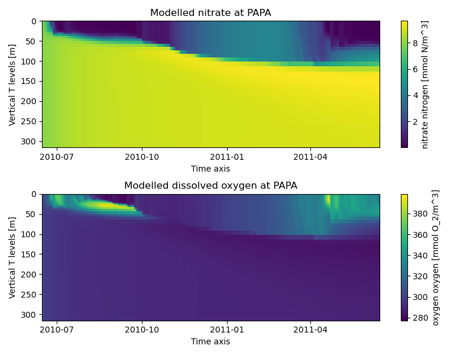

.. _nemo:

#############################
NEMO-ERSEM in a water column 
#############################

This tutorial demonstrates how to configure and run NEMO 1D (water-column) reference configuration C1D_PAPA with ERSEM biogeochemistry. This example is a demonstration of the concept, as it combines hydrodynamics of ocean station `PAPA <https://www.pmel.noaa.gov/ocs/Papa>`_ in the North Pacific Ocean with biogeochemistry of `L4 station <https://www.westernchannelobservatory.org.uk/>`_ in the Western English Channel. Users are encouraged to modify this example to fit their own purposes.

We recommend to read the brief description of the NEMO `C1D_PAPA configuration <https://forge.ipsl.jussieu.fr/nemo/chrome/site/doc/NEMO/guide/html/cfgs.html#c1d-papa>`__ before continuing with this tutorial.

Step 1: Obtaining the code
~~~~~~~~~~~~~~~~~~~~~~~~~~~~

The input data contained in INPUTS_C1D_PAPA_v4.0.tar file must be obtained from `NEMO Reference configurations inputs <https://zenodo.org/record/1472245#.Yt6_QIzMKEI>`__ repository on Zenodo  and unpacked into the working directory.

NEMO4 code base with FABM support can be obtained in the corresponding `repository <https://github.com/pmlmodelling/NEMO4.0-FABM>`__. The next step is to download `FABM <https://github.com/fabm-model/fabm>`__ and `ERSEM <https://github.com/pmlmodelling/ersem>`__. Finally, I/O server `XIOS-2.5 <https://forge.ipsl.jussieu.fr/nemo/chrome/site/doc/NEMO/guide/html/install.html#extract-and-install-xios>`__ must be downloaded and `installed <https://forge.ipsl.jussieu.fr/ioserver/>`__. The compiled xios_server.exe executable should be copied into the working directory.

Step 2: Compiling the code
~~~~~~~~~~~~~~~~~~~~~~~~~~~

First, FABM must be compiled with ERSEM support, specifying nemo as a physical host. The following commands can be run in a command line or wrapped into an executable file for easy recompilation at any future point:

  .. code-block:: bash
        
        old = `pwd`                      #remember current (working) directory
        mkdir -p ~/build/nemo-fabm-ersem # create directory for the build
        cd ~/build/nemo-fabm-ersem       # go to the build directory
        cmake <FABM_DIR> -DFABM_HOST=nemo -DFABM_ERSEM_BASE=<ERSEM_DIR> -DCMAKE_INSTALL_PREFIX=~/local/fabm/nemo-fabm-ersem
        #replace <FABM_DIR> and <ERSEM_DIR> with the corresponding directories the FABM and ERSEM code bases were downloaded to.
        make install
        make -j4
        cd $old                          # return to the working directory
        
Thereafter, it is time to compile the NEMO executable. Users may refer to the C1D_PAPA_FABM_ERSEM configuration provided with the NEMO4.0-FABM. The critical point is to specify all the necessary compilation keys in cpp_X.fcm file, i.e. key_c1d for compilation in 1D, and key_fabm for FABM support:

  .. code-block:: bash
  
       bld::tool::fppkeys   key_c1d key_mpp_mpi key_iomput key_nosignedzero key_top key_fabm
       
Next, compile the model by executing the following lines:

  .. code-block:: bash
  
    #!/bin/bash

    module load mpi

    NEMO_BUILD_DIR=$<NEMO_DIR>
    RUN_DIR=$<RUN_DIR>
    export XIOS_HOME=$<XIOS_DIR>
    export FABM_HOME=$HOME/local/fabm/nemo-fabm-ersem
    # replace <NEMO_DIR> and <XIOS_DIR> with the path to the corresponding code bases and <RUNDIR> with the working directory. FABM_HOME in this example corresponds to the directory where FABM-ERSEM was installed.
    
    ARCH=GCC_PMPC # specify build architecture

    cd $NEMO_BUILD_DIR
    ./makenemo -m $ARCH -r C1D_PAPA_FABM_ERSEM -n C1D_PAPA_FABM_ERSEM_BLD_SCRATCH | tee compile.log
    mv $NEMO_BUILD_DIR/cfgs/C1D_PAPA_FABM_ERSEM_BLD_SCRATCH/BLD/bin/nemo.exe $RUN_DIR/
    echo "Done."
    
The script above will compile the model and move the nemo executable into the working directory.

Note that the architecture file might require some editing depending on the machine the model is compiled and run on. This will include compiler version, compiler flags and links to netCDF libraries. Here, we are pointing our compilation to arch-GCC_PMPC.fcm file (available within NEMO4.0-FABM repository) to compile on a typical PML workstation running Fedora Linux distribution and using a GNU Fortran compiler.

Step 3: Getting ready to run the model
~~~~~~~~~~~~~~~~~~~~~~~~~~~~~~~~~~~~~~~~

Within the working directory, create a link to the desired model configuration file, e.g.:

  .. code-block:: bash
  
     ln -sf <ERSEM_DIR>/testcases/fabm-ersem-15.06-L4-noben-docdyn-iop.yaml fabm.yaml
     # replace <ERSEM_DIR> with the directory containing the ERSEM code.
     
ERSEM requires some external inputs, which must be provided. The following lines should be appended to the fabm.yaml file. Note that for simplicity we are using constant parameter values here. Depending on the configuration, the list of required external inputs will vary.

  .. code-block:: bash
  
       pco2a:
         model: horizontal_constant
         parameters:
           value: 400.
           standard_name: mole_fraction_of_carbon_dioxide_in_air
       ADY_0:
         model: horizontal_constant
         parameters:
           value: 1.0e-10
           standard_name: gelbstoff_absorption_satellite

Create links to, or copy namelist files from NEMO cfgs/C1D_PAPA_FABM_ERSEM folder into the working directory. Repeat the same procedure for *.xml files. file_def_nemo.xml defines which outputs will be saved, and at what frequency. For the purpose of this example, we will save a range of daily averaged pelagic and benthic state and diagnostic variables. This file can be used as a template to specify the desired range of model outputs.

Step 4: Running the model
~~~~~~~~~~~~~~~~~~~~~~~~~~~

The model is deployed by running the executable file in the working directory:

.. code-block:: bash
 
      ./nemo.exe

As a result, several output files will be generated according to specifications in file_def_nemo.xml file. Additionally, NEMO will generate restart files. The outputs can be visualised using netCDF viewer (e.g. `ncview <http://meteora.ucsd.edu/~pierce/ncview_home_page.html>`_ or `PyNcView <https://github.com/BoldingBruggeman/pyncview>`_), or in Python using `xarray <https://docs.xarray.dev/en/stable/#>`_:

.. code-block:: python

      import xarray as xr                                                          # import xarray
      import matplotlib.pyplot as plt                                              # import matplotlib
      dat = xr.open_dataset('C1D_PAPA_1d_20100615_20110614_ptrc_T.nc')             # open dataset with ERSEM variables
      fig,axes=plt.subplots(nrows=2,figsize=(8,6))                                 # create figure with 2 subplots
      dat.N3_n[:,0:35,1,1].plot(x='time_counter',yincrease=False,ax=axes[0])       # plot Hovmöller diagram for nitrate
      dat.O2_o[:,0:35,1,1].plot(x='time_counter',yincrease=False,ax=axes[1])       # plot Hovmöller diagram for oxygen
      axes[0].set_title('Modelled nitrate at PAPA')                                # add title
      axes[1].set_title('Modelled dissolved oxygen at PAPA')                       # add another title
      fig.tight_layout()                                                           # make it look nice
      
In the example above we plot the variables over the entire modelled period, but only in the upper 35 vertical layers (from surface down to ~300 m depth). We also have to specify spatial dimensions of the output, as 1D configuration in NEMO actually has horizontal resolution of 3x3 grid points.

