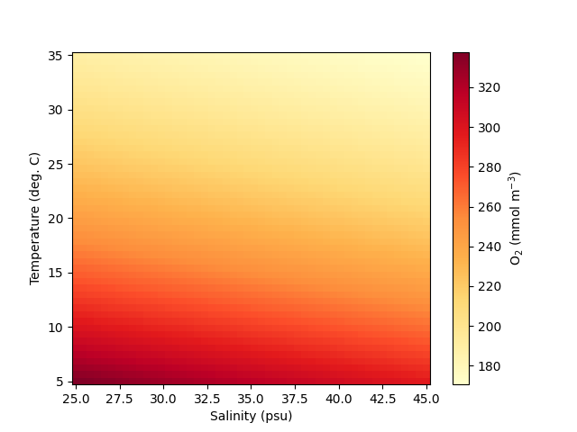

.. _pyfabm:

#############################
Python front-end (``pyfabm``)
#############################

``FABM`` comes with a ``pyfabm`` package for the ``python`` programming language.
This package enables you to access 
`FABM's <https://github.com/fabm-model/fabm/wiki>`__ biogeochemical models directly 
from ``python``. For instance, you can enumerate a model's parameters and variables, 
or obtain temporal derivatives and diagnostics for any given environment and 
model state. In combination with a ``python``-based time integration scheme 
(e.g., ``scipy.integrate.odeint``), this also allows you to perform model 
simulations. More information about ``pyfabm`` can be found on the 
`FABM wiki page <https://github.com/fabm-model/fabm/wiki/python>`__. 
Below you can find brief instructions on how to use ``pyfabm`` with ERSEM.

Building ``pyfabm``
~~~~~~~~~~~~~~~~~~~

To build the ``python`` driver and use it with ``ERSEM``, you must first obtain 
copies of the ``FABM`` and ``ERSEM`` codes. The latest version of each can be 
obtained by cloning their respective code repositories using 
`git <https://git-scm.com/>`__. The instructions of how to do this are found
:ref:`here <tutorials>`.

To run the install script you will need to have ``wheel`` and ``numpy`` installed.
This can be done via:

.. literalinclude:: ../../../github-actions/pyfabm-ersem/pyfabm-ersem-dep-debian.sh
    :language: bash
    :linenos:

To install PyFABM-ERSEM, we suggest you use the following script below

.. literalinclude:: ../../../github-actions/pyfabm-ersem/pyfabm-ersem-build.sh
    :language: bash
    :linenos:

Running ``pyfabm``
~~~~~~~~~~~~~~~~~~

To demonstrate how ``pyfabm`` can be used with ERSEM, we will calculate the 
oxygen saturation concentration as a function of temperature and salinity 
using the method implemented in ERSEM, which is taken from Weiss (1970).

.. note::
    The following script requires ``matplotlib`` to be installed. This can
    easily be done via ``pip`` in the following way:

    .. code-block:: bash
        
        python -m pip install matplotlib

With ``pyfabm`` installed, this can be achieved using the following code:

.. literalinclude:: ../../../github-actions/pyfabm-ersem/pyfabm-tut.py
    :language: python
    :linenos:

In additions, example Jupyter notebooks that use the Python front-end can 
be found in ``<FABMDIR>/testcases/python`` and more examples can be found 
on `the FABM wiki <https://github.com/fabm-model/fabm/wiki/python>`__.

